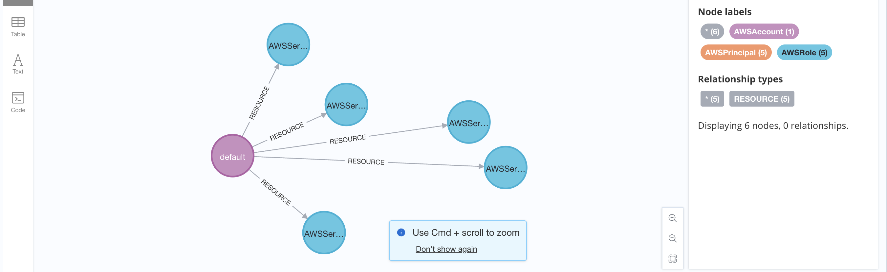

# zee-combinator

A natural language querying interface to your AWS infrastructure built on top of cartography

## **this is a small infrastructure so far**

## **this is a little bigger infrastructure i spun up**
 

### **with some filters attached**

**only show relationships for EC2 instances (e.g., to databases or load balancers)**

